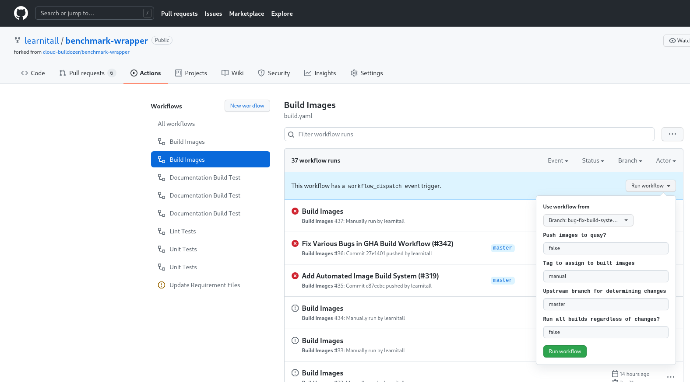

# Docker Image Testing

## GitHub Workflow Walkthrough

benchmark-wrapper uses [GitHub Actions](https://docs.github.com/en/actions) to automate builds of wrapper Docker images. This is done through the workflow defined in [build.yaml](https://github.com/cloud-bulldozer/benchmark-wrapper/blob/master/.github/workflows/build.yaml). The basic structure of the workflow is as follows:

1. Use [ci/build_matrix.py](https://github.com/cloud-bulldozer/benchmark-wrapper/blob/master/ci/build_matrix.py) to discover Dockerfile candidates for build and create two [GitHub Actions Job Matrices](https://docs.github.com/en/actions/reference/workflow-syntax-for-github-actions#jobsjob_idstrategymatrix). One will be a 'build matrix' that will organize building each selected Dockerfile candidate on each supported architecture. The other will be a 'manifest matrix' that will organize creating a manifest for each selected Dockerfile candidate that includes the built images across the supported architectures.
1. For each Dockerfile on each architecture, build the Dockerfile, and if on the master branch, then tag with `latest` and push to quay. If the build was manually triggered by a user, then instead of tagging with `latest`, tag with the given input tag and only push to quay if the user says to do so.
1. If we pushed to quay in the previous step, then for each Dockerfile, create a manifest that includes each successfully built architecture image and then push it to quay.

Note that:

* A Dockerfile candidate is a Dockerfile within the benchmark-wrapper repository that sits underneath the parent directory for each wrapper. It's expected that each wrapper has a single Dockerfile that is compatible across architectures, rather than having multiple Dockerfiles split by architecture.
* The build matrix Python script will dynamically discover all available Dockerfiles within the benchmark-wrapper repository and then only select those that need to be built based on what has changed.
*  Right now we support `amd64` are currently working on `arm64` images.

Here's a diagram summarizing all those words:

And now let's work through an example, just to drive it all home.

Let's say that I push two changes to the master branch, one within the uperf wrapper under `snafu/benchmarks/uperf` and one within the fio wrapper under `snafu/fio_wrapper`. Our GHA Workflow will start by kicking off a job to execute the build matrix Python script. The script will discover that the fio and uperf benchmarks have changed and that their Docker images need to be rebuilt. Four jobs will then be kicked off to do the following in parallel with [fail-fast](https://docs.github.com/en/actions/reference/workflow-syntax-for-github-actions#jobsjob_idstrategyfail-fast) disabled:

1. Build uperf on `amd64`, tag with `amd64-latest`, and push to quay
1. Build uperf on `arm64`, tag with `arm64-latest`, and push to quay
1. Build fio on `amd64`, tag with `amd64-latest`, and push to quay
1. Build fio on `arm64`, tag with `arm64-latest`, and push to quay

After these jobs have completed, regardless of pass/fail for each job, two more jobs will be kicked off to do the following (in parallel again with no fast-fail):

1. Create a manifest named `latest` for uperf with the `amd64-latest` and `arm64-latest` images and push to quay
1. Create a manifest named `latest` for fio with the `amd64-latest` and `arm64-latest` images and push to quay

If the uperf image on `arm64` fails to build, then the `amd64` image will still be built and pushed to quay. The manifest will be updated with the new `amd64` image and still reference the existing `arm64` image within quay.

Now let's say that I push to the main branch a change within `run_snafu.py`, our main entrypoint script. Our GHA Workflow will again kick off a job to execute the build matrix Python script. This time the script sees that a core component of snafu has changed and that a rebuild is required for each wrapper image. The necessary image build and manifest build jobs will then be kicked off.

## Automated Build Testing

What's great about GHA workflows is that they can be used for free within forks. Our [build.yaml](https://github.com/cloud-bulldozer/benchmark-wrapper/blob/master/.github/workflows/build.yaml) workflow includes a manual trigger which allows for these builds to be kicked off manually as needed. This can be used to test Dockerfile builds before creating a PR or for any 'thought experiment' changes. For instance, if I have a new branch called ``my-new-feature`` that modifies a core component of the snafu code base, I can test the image build for each wrapper with this change by going to my fork in GitHub, selecting the "Actions" tab, clicking on the "Build Images" workflow and then selecting the "Run Workflow" button:

These are the paramemters available:

* **Use workflow from**: Branch to checkout and run the workflow from. Defaults to your fork's default branch.
* **Upstream branch for determining changes**: Branch used to compare the source branch against. This is normally the branch that the source branch above will be merged into. Defaults to ``master``.
* **Run all builds regardless of changes?**: If ``true`` then all available Dockerfile candidates will be built, regardless of whether or not they actually need to be based on the changes in the source branch. Defaults to ``false``.

And these are the secrets that need to be set within your fork:

* **QUAY_ORG**: Organization or user within quay to publish the built images to.
* **QUAY_USER**: Quay user with push permissions to the target organization.
* **QUAY_TOKEN**: Token to authenticate the above quay user.

More information on getting started with quay can be found [here](https://docs.projectquay.io/use_quay.html).
