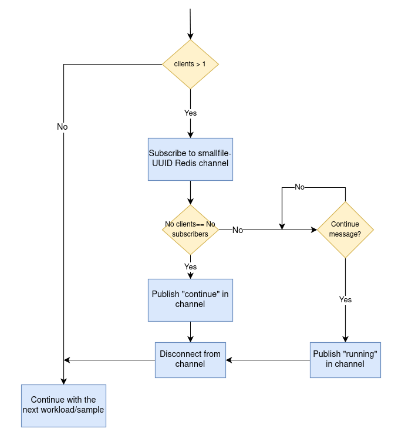

# Smallfile
[Smallfile](https://github.com/distributed-system-analysis/smallfile) distributed metadata-intensive workload generator for POSIX-like filesystems

## Synchronizing parallel smallfile operations

Smallfile wrapper's allows to launch multiple smallfile's workloads through a unique command invocation. With the help of Ripsaw it's possible to launch multiple instances of these workloads in parallel.
Smallfile wrapper uses redis to synchronize these operations. The schema below represents the flow followed to synchronize them.

As represented above. Smallfile's Snafu wrapper basically blocks execution waiting for a "continue" message in a Redis channel. This message is sent to the channel by the latest smallfile client to finish a workload or sample execution. This is handled by checking the number of channel subscribers is the same as the number of smallfile clients configured in the benchmark.

